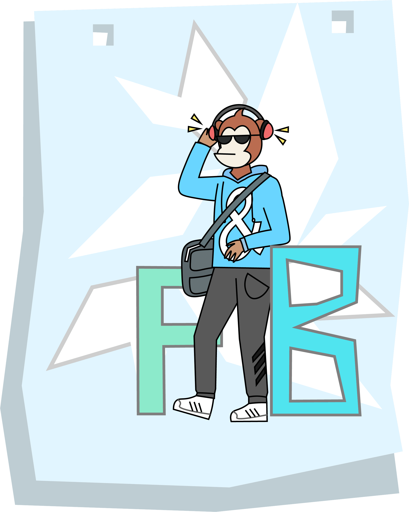

这里是yy网页制作的详细步骤及问题反思

**重点：代码编辑地（VS Code）  HTML    CSS     JavaScript**


## 步骤

**首先**，我先把“代码编辑地”，也就是 **VS Code** 下载好，因为这是一个可以连接 **Github** 的一个非常好的软件，当然，还有其他的编辑地  

**其次**就是在桌面建立新的文件夹📂随便你命名，你喜欢就好  

- 打开记事本什么都不写的直接另存在新建的📂里，命名随便，但是拓展名必须是 `.html` (这是网页的“外壳”)  

- 再同样建立一个拓展名为 `.css` (这个则是给你的网页进行粉饰)  

- 同样再建立拓展名为 `.js` 的（这个是为你的网页编写下一步或者即将展示的内容——我目前感觉是这样的，理解的还不够透彻）  

**第三步**就是打开 **VS Code** 对这三个分别进行代码编辑   

**最后** 想要测试网页可以在保存代码后，在📂中打开 `.html` 的那个文件即可（可以选择你常用的浏览器打开）


## 更新网页内容

⭐网页的制作不像 **Markdown** 文档，**不要**在 **Github** 进行更改

回到 **VS code** 进行代码更改

再执行  

```bash  

git add .  
git commit -m "描述你修改了什么，例如：更新了CSS颜色"  
git push
```

执行后, **GitHub** 上的仓库会自动更新。**GitHub Pages** 会在几分钟内自动重新部署你的网站，刷新浏览器就能看到最新效果啦😊


# 🕹️ HTML、CSS、JS 是如何“勾搭”在一起的？
一句话总结：**HTML** 是骨架，**CSS** 是衣服，**JS** 是神经。 三者通过 **DOM** 这个“中介”互相配合，让网页活起来。

## 1️⃣ HTML 和 CSS 的交互
**HTML** 负责“有什么”，**CSS** 负责“长什么样”。它们通过 `class、id`、**标签名**连接。

实例（招新网站的卡片）
```
html


<div class="card">
  
  <div class="card-content">
    <h3>开发程序猿</h3>
    <p>前端开发是……</p>
  </div>
</div>
```

```
css


.card {
  display: flex;
  border-radius: 32px;
  background: #f8fafc;
}
.card-img {
  width: 260px;
  transition: transform 0.3s;
}
.card-img:hover {
  transform: translateY(-6px);
}
```
连接方式：**HTML** 里的 `class="card"` 对应 **CSS** 里的 `.card`，样式就生效了。

❗️  **HTML** 说“我有一件叫 `card` 的衣服”，**CSS** 说“这件衣服要穿成 `flex` 布局，还要圆角”。然后网页就变好看了。

## 2️⃣ HTML 和 JS 的交互
**JS** 可以找到 **HTML** 元素，然后**读取或修改** 它们。通过 `getElementById、querySelector` 等。


实例：点击按钮复制邮箱

```
html


<span id="email">newthread_geek@outlook.com</span>
<button id="copyBtn">复制</button>
```

```
javascript


const btn = document.getElementById('copyBtn');
btn.addEventListener('click', () => {
  const email = document.getElementById('email').innerText;
  navigator.clipboard.writeText(email);
});
```

连接方式：`id="copyBtn"` 让 **JS** 能抓到它，然后监听点击。

❗️ **JS** 说“嘿，那个 `id` 叫 `copyBtn` 的按钮，你被点了之后，去把邮箱那个家伙的文字复制一下”。

## 3️⃣ CSS 和 JS 的交互
**JS** 可以 **动态修改** **CSS** 样式，或者 **添加/删除类名**，从而改变外观。


实例：问答折叠（点击展开答案）

```
html


<button class="faq-question">什么是Geek？<span class="icon">+</span></button>
<div class="faq-answer">拥有好奇之心，爱钻研。</div>
```

```
css


.faq-answer {
  display: none;   /* 默认隐藏 */
}
.faq-answer.show {
  display: block;  /* 有 show 类就显示 */
}
javascript
document.querySelector('.faq-question').addEventListener('click', () => {
  const answer = document.querySelector('.faq-answer');
  answer.classList.toggle('show');   // 添加/删除 show 类
  // 同时改变图标
  const icon = document.querySelector('.icon');
  icon.textContent = answer.classList.contains('show') ? '−' : '+';
});
```

连接方式：**JS** 给答案元素添加/移除 `show` 类，**CSS** 根据这个类决定显示还是隐藏。

❗️ **JS** 像遥控器，按一下给答案贴上“显形符咒（show 类）”，**CSS** 看到符咒就让它现身。


## 4️⃣ 三者完整交互流程（以复制邮箱为例）
|步骤	|谁在做	|动作|
|:---|:---|:---|
|1	|HTML	|渲染一个按钮（id="copyBtn"）和一个邮箱 span|
|2	|CSS	|给按钮蓝色背景、圆角、悬停效果|
|3	|用户|	点击按钮|
|4	|JS	|监听到点击，找到邮箱元素，读取文字，复制到剪贴板，弹出提示|
|5	|CSS（可选）	|按钮变成绿色（添加临时类），反馈用户|


### 🧪 快速验证方法
在浏览器里按 `F12 → Console`，输入：

```
javascript


// 改文字
document.querySelector('h1').innerText = '我被JS改了！';
// 改样式
document.querySelector('.card').style.backgroundColor = 'yellow';
// 添加类
document.querySelector('.faq-answer').classList.add('show');
```

你会看到网页立刻变化 —— 这就是三者的实时交互。


## 💡 核心总结
|交互	|通过什么	|例子|
|:---|:---|:---|
|HTML ↔ CSS	|`class / id /` 标签选择器	|`.card { display: flex; }`|
|HTML ↔ JS	|`getElementById, querySelector`	|`document.getElementById('copyBtn')`|
|CSS ↔ JS	|`classList, style` 属性	|`element.classList.add('show')`|


❗️ **HTML** 是房子，**CSS** 是装修，**JS** 是住在里面的你。你可以开灯（显示答案）、关窗（隐藏元素）、换墙纸（改背景色）。三者缺一，房子要么是毛坯，要么是鬼屋👻


